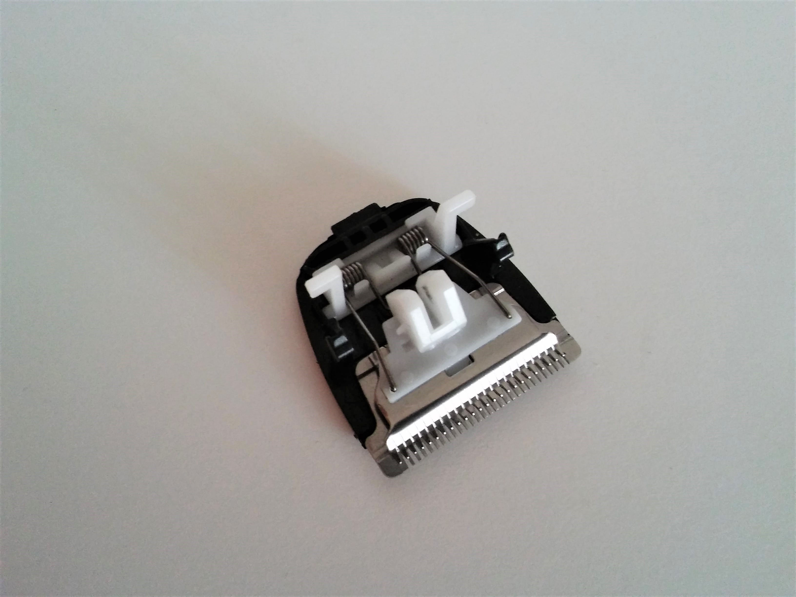

# Disassembly of SK-5803 Hair Clipper

## Introduction
On a trip in Sicily, I bought a really cheap China made hair clipper for 6 Euro at a flea market. It has a rechargeable battery and does not need an external AC adapter. I was curios to understand how it works so as soon as I came back home I disassembled it and reversed the circuit. Here I am documenting my findings and observations.

## Analysis
The content of the box is pretty straightforward:
- the hair clipper
- a type C power plug
- a pair of cleaning brushes
- lubrication oil for the shaver head

The hair clipper works, it does cuts hair and beard. It does not have a lot of power however, it gets clogged pretty easily and that makes it slow down often. It is rated for both 100-240 volt and 50/60 hz current.

Interestingly the hair clipper does not work without the battery when it is plugged in. This hints that the electronics does not contain a good AC converter but it relies on the battery to provide a constant flow of current.

Disassembling the hair clipper is not difficult. Except the battery cover which is kept in place by a screw, all parts are joined by hooks. Starting by the shaving head the clipper can be fully disassembled going top-down.

The shaving head uses a peg-and-slot mechanism to create an oscillating motion from a rotary motion, which is in turn created by an electric motor.

The electronic circuit of the hair clipper is not complicated and can be reversed easily with the naked eye.

It can be seen that the electric motor is powered directly by the battery (Main circuit), while the rest of the circuit is a simple battery charger.
The battery charger is constant DC charger with: a zener diode (D2) for overcharge protection, a LED indicator (D3), a rectifier, and a voltage adapting circuit. The rectifier is a simple half-wave rectifier which uses a transformer (T1) to scale down the voltage. Interestingly the rectifier diode (D1) and the smoothing capacitor (C1) are in the high-voltage part of the circuit instead of being after the transformer in the low-voltage part. Probably the high-voltage components were cheaper. Another interesting detail is the voltage adapter circuit which adapts the current accordingly to the input voltage in the range 100-240 to keep a constant output. It works by using a transistor as a variable resistor.

The charging circuit is simple but has many inefficiencies:
- it does not make use of the full AC sine wave
- it waste power on resistors (R1 and R2) and the small transformer

## Conclusions:
The electrical circuit is not as efficient as it could be to save on component costs, this however is not a big problem given the use case. Despite its simplicity, the circuit does not seem to be a fire hazard.
The quality of the mechanical parts does not qualify the hair clipper as "built to last".